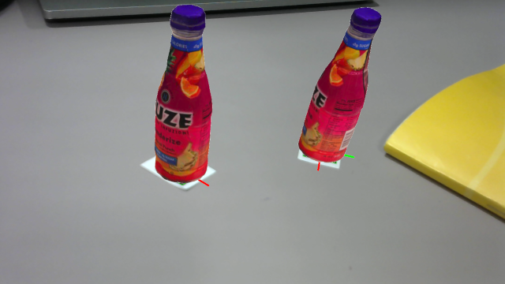

# AR-with-Aruco
Augmented Reality with Aruco markers.

To run

```
python3 ar.py
```

## Sample Output



## Acknowledgement

The model `fuze.obj` is taken from https://github.com/mmatl/pyrender/tree/master/examples/models.
